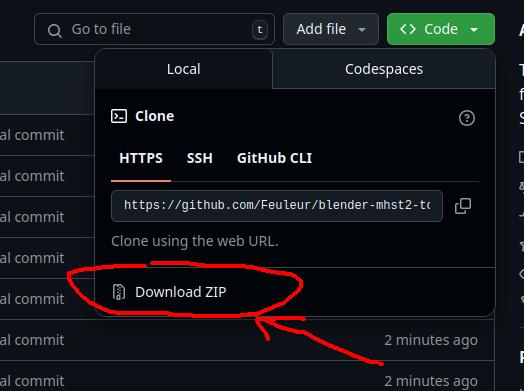
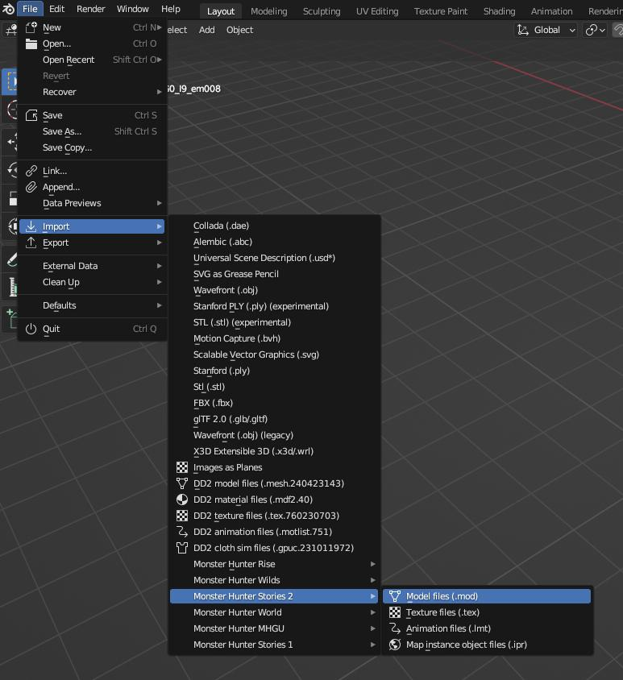
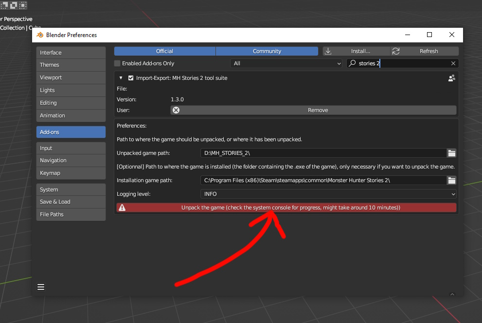
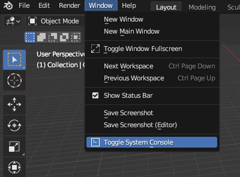
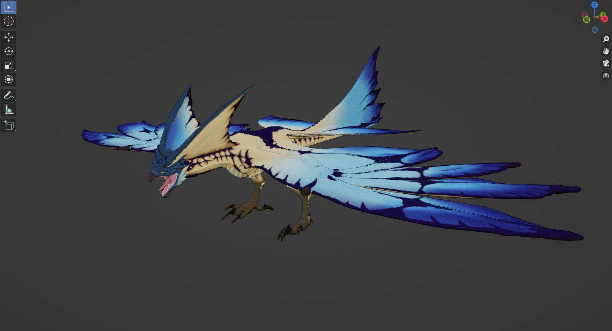
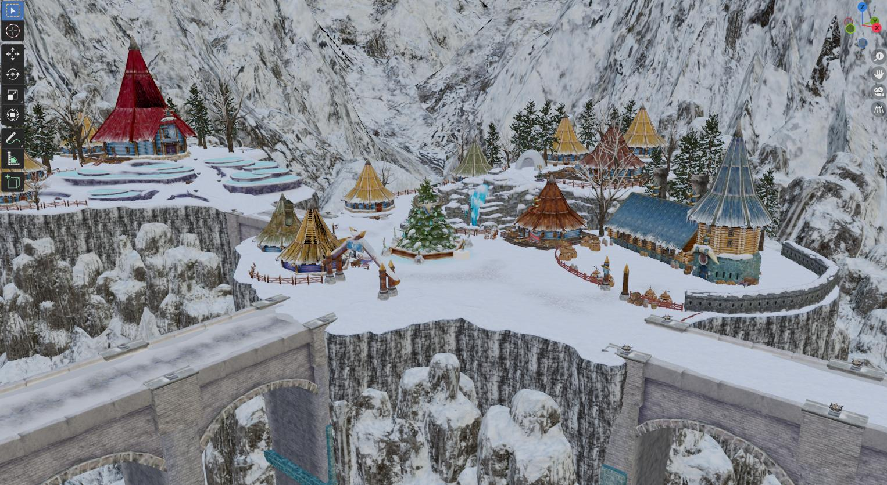
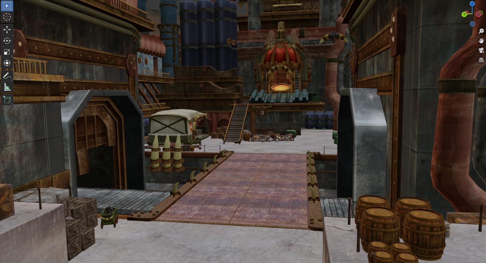

# Blender Monster Hunter Stories 2 import suite

This blender addon provides a suite of file importers for Monster Hunter Stories 2 files.

Tested on blender 3.6 & 4.3.

## Installation

Download the .zip file of the repository, and install it using blender's extension manager.

The importers can then be found here:

## Game unpacking

Game files are stored in .arc archives, for which an extractor is included. To do the file extraction, simply press the big red button in the addon settings AFTER specifying the extraction and installation paths.

A lot of information is written in the console, such as if an object failed to be importerd or was filtered away. If the console isn't opened by default, you can access it through the following menu:

## Useful paths

Monster models are located in the `mod/mo` directory.

Monster animations are located in the `mot/em` directory.

Baby monster are stored as animations for the main monster model, and are located in the `mod/scale` directory.

Player models are located in the `mod/pl` directory.

Player animations are located in the `mot/pl` directory.

Map models are located in the `stage` directory.

A list of monster IDs (and much more) can be found at this link:

https://docs.google.com/spreadsheets/d/1dLvVquwX2pwz5AaTFIM0kZ-2CQzSP7jLT89Ub4T-it4

## Supported types

### Meshes (mod files)

Meshes files are supported at import. You can import a specific Level of Details (LoD) ; a lower number means the model will be more detailed. When importing a mesh, you'll have the option to also import the material file associated to it automatically.

Some quality of life features have been included like bone connection, although that feature is based on pure guesswork, and will probably break animations.

### Textures (tex files)

Texture files are supported at import. Since blender is optimized to load more standard image formats, when a texture is loaded, a .png equivalent will automatically be created alongside it.

The next time that texture is loaded, the importer will use the .png file instead for a much faster loading time. This is enabled with the "Use PNG cache" setting shown at import.

You can overwrite the already generated .png images by checking the "Overwrite PNG" checkbox.

### Animations (lmt files)

Animation files are supported at import. Due to a mismatch between the way blender and the game handle animations, a target armature is needed to apply the proper corrections when importing an animation. Make sure you have a single armature selected when doing so.

LMT files are found in "mot" folders scattered around in the game files.

Animations will be loaded as actions, which can be accessed in the Action Editor in the Dope Sheet tab in Blender.

### Maps (ipr files)

Map files are supported at import. While most assets are stored in .ipr files, there might be an additional .mod file to import next to it for the ground of most maps.

